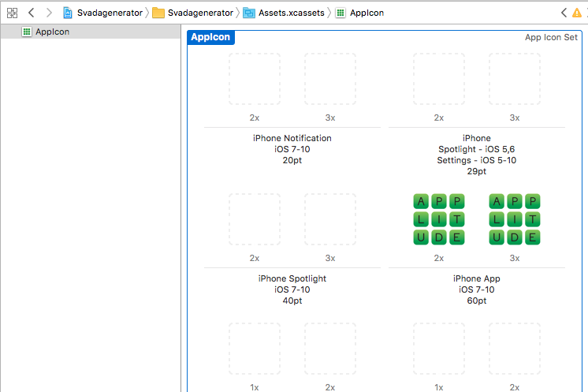

# Hands-On iOS 11 Development with Swift 4 and Xcode 9

Welcome to our workshop! Today, we are going to create a nonsense generator. The app is simple, yet covers many fundamental concepts all app developers need to know.

If you're worried about prerequisites, you probably shouldn't be. All you need is knowledge about some basic programming concepts, like loops and objects.

## Program

1. We hand out the [Swift cheat sheet](swift-cheat-sheet.md).
2. A short presentation (not currently in this repo), that briefly covers:
   - Native vs. cross-platform app development
   - iOS app architecture
   - The [View Controller life cycle](https://i.stack.imgur.com/g19fw.png)
   - Programming in Swift
3. A live coding session, where we recreate the master branch's Xcode project. The goal of this part is that you will become confident to start developing.
4. A problem-solving session, where you will continue the development of the app. This is where we think you will learn the most. When you get stuck, we'll gladly help.


## Setting up the Development Environment

To develop iOS apps, you need a Mac with Xcode installed. Installing Xcode is fairly straight forward:

1. Search for `Xcode` on your Mac's App Store.
2. Click `Install`.
3. Once the installation is finished, open Xcode. When prompted with a dialog asking you to `Install required components`, choose `Yes`.

## Exercises

### 1: Warming up

#### 1.1

Currently, our app displays "..." instead of generated nonsense when it starts up. Modify the code so that it generates a sentence before the app is visible.

Hint: Copy-paste a line into the `viewDidLoad` method.

##### Walkthrough

The UIViewController life cycle tells us that the `UIViewController.viewDidLoad` method is called when its `view` property has been loaded. That is just after the `nonsenseLabel`'s text is set to "...", and is therefore the perfect spot to override it.

Change the `viewDidLoad` method to:

```swift
override func viewDidLoad() {
    super.viewDidLoad()

    nonsenseLabel.text = nonsenseProvider.generateSentence()
}
```

#### 1.2

Our app looks kind of boring. Make it shine using **Interface Builder**.

Hint: Open `Main.storyboard`, and the `Attributes inspector` (needle icon) in the right pane. Change colors, fonts, font sizes and more!

### 2: Turning the page 

#### 2.1

Few great apps have only one page (or View Controller)! But before we can add another, we need something to manage our View Controllers: a **Navigation Controller**.

Embed our View Controller in a Navigation Controller.

##### Walkthrough

Select our `View Controller` in the **Document Outline** (the rightmost of the two left sidebars). In the Xcode menu, choose `Editor -> Embed In -> Navigation Controller`. Remember to run the app to see the changes!

#### 2.2

If you ran the app, you probably noticed our `View Controller` got a top bar. What you see is its `Navigation Item` property. It is commonly used for displaying a title and some easily accessible buttons.

Set a title for the Navigation Item. Then, add a `Bar Button Item` to it.

Hint: Set the title in the Attributes Inspector. Add the `Bar Button Item` from the Object library.

##### Walkthrough

To add a title, select the `Navigation Item` in the Document Outline, and edit its `Title` field from the Attributes Inspector. Set it to "Nonsense Generator" or something else.

To add a Bar Button Item, search for "button" in the **Object library** (lower right corner). Drag a `Bar Button Item` to the right side of our `View Controller`'s Navigation Item, in the Storyboard. From the Attributes Inspector, change its `Title` property to "About".

#### 2.3

It's time to add our second View Controller. From the Object library, drag a View Controller onto our Storyboard. From the Document Outline, name it `About View Controller`.

Then, add a **segue** of type `Show` from the `View Controller`'s `About` button to the `About View Controller`.

Run the app and tap our new About button!

Hint: Right-click-and-drag in our Storyboard.

##### Walkthrough

First, add the `About View Controller` as described in the exercise.

Then, right-click-and-drag from the `About` button in our original `View Controller`'s `Navigation Item`, to the `About View Controller`. When you let go of the cursor, a black pop-up will appear. Choose `Show` under `Action Segue`.

#### 2.4

We just added a new page to our app, but it looks very blank! Add something to it. Maybe a `Label` or `Image View` from the Object library?

### 3: Adding an App Icon

#### 3.1

We have supplied some app icons in the repo's `App Icons` directory. Add an app icon to the `Assets.xcassets` folder in Xcode.

##### Walkthrough

In Xcode's **Project navigator** (folder icon in left pane), click on `Assets.xcassets`. Then, drag the app icons from the repo's `App Icon` directory to the icon placeholders.

For the app icon to be visible in the simulator, you need to add at least the "iPhone App" icons.

It should look something like this:




### 4: Finally, some programming

#### 4.1

Now it's time to utilize the mysterious `AppDelegate.swift`. This file contains methods similar to those in the View Controller life cycle, but instead of belonging to a View Controller, they are system-wide.

Modify the app so that it generates new nonsense when the user leaves the app and then opens it again.

Hints: You'll want to put some code in `applicationWillEnterForeground`. To get our AppDelegate instance from the View Controller, use `UIApplication.shared.delegate as! AppDelegate`.

## Made by

<table>
    <tr>
        <td align="center">
            
            <br>
            <a href="https://github.com/gautesolheim/">Gaute Solheim</a>
        </td>
        <td align="center">
            
            <br>
            <a href="https://github.com/espennaess">Espen Næss</a>
        </td>
    </tr>
</table>
